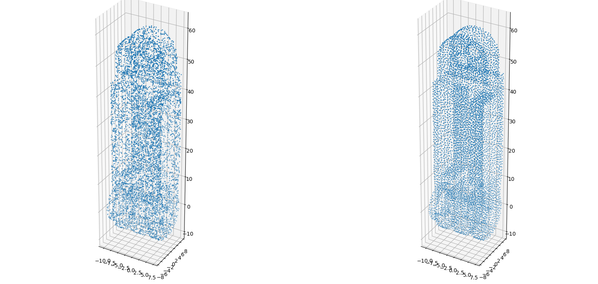
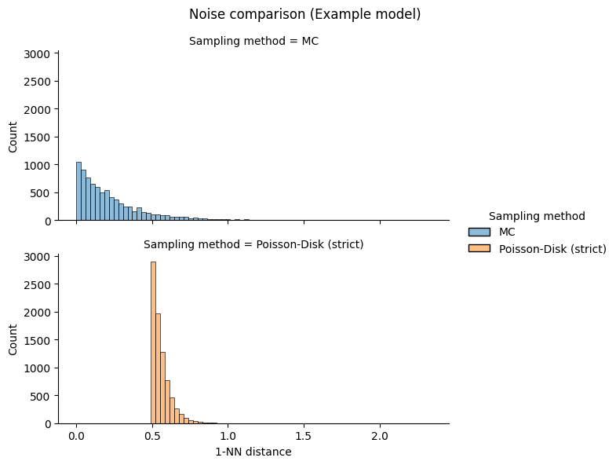
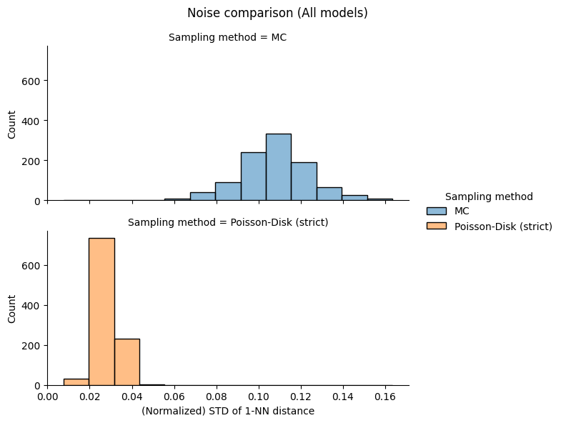

# Comparing Two Point Cloud Sampling Methods
In the PIE-NET paper, point clouds were generated by sampling points from CAD models (triangle meshes). Various sampling methods exist and the following two are the focus of this quick study:
1. Monte Carlo (MC), a classic uniform sampling method;
2. Poisson-Disk [[2](https://ieeexplore.ieee.org/document/6143943)], which enforces a minimal distance ($2r$) between any two sampled points.

As in the paper, 8096 was set to be the desired number of points for point clouds. We will see that MC was able to generate exact 8096 points, whereas Poisson-Disk could at best approximate the number. 1000 point clouds were generated for this comparison work.

## Visual Comparison and Discussion
As an example, point clouds sampled from one CAD model by the two methods are displayed below, Monte Carlo on the left and Poisson-Disk right.

*Q*: Why did Poisson-Disk based point clouds show structural details better?

*Discussion*: Point clouds sampled by the Poisson-Disk algorithm were less noisy, as evidenced by the smaller dispersions of 1-NN distances in the following section.
**In other words, the spatial distribution of points were more regular. This made edges and corners, the irregulars [[3](https://cecas.clemson.edu/~stb/ece847/internal/classic_vision_papers/attneave_1954.pdf)], stand out more.**
I would guess that PIE-NET also perform better for point clouds sampled with Poisson-Disk.

## Quantitative Comparison
#### Sampling Speed
Poisson-Disk was orders of magnitude slower than Monte Carlo.
| Monte Carlo | Poisson-Disk |
|---:|---:|
|3.5 seconds| 1302.4 seconds|
*Table 1. Total sampling time for 1000 point clouds.*

#### Number of Points
Poisson-Disk could not generate exactly the desired number of points (max $5%$ error).
| Monte Carlo | Poisson-Disk |
|---:|---:|
|8096.0| 8093.8|
*Table 2. Average number of sampled points for 1000 point clouds.*

#### Noises
To measure the noises in point clouds, *1-NN distance* was calculated for each point for every point cloud.

*Fig 1. Distribution of 1-NN distances for an example point cloud. Poisson-Disk (orange) had a much smaller dispersion and a larger minimum ($2r$, where $r$ is the radius of the 'disk').*

*Fig 2. Distribution of STDs of 1-NN distances for 1000 point clouds. Overall, Poisson-Disk (orange) had smaller dispersions of 1-NN distances, meaning points were more regularly distributed over the object surface.*

## References
1. [PIE-NET: Parametric Inference of Point Cloud Edges](https://arxiv.org/abs/2007.04883)
2. [Efficient and Flexible Sampling with Blue Noise Properties of Triangular Meshes](https://ieeexplore.ieee.org/document/6143943)
3. [Some Informational Aspects of Visual Perception](https://cecas.clemson.edu/~stb/ece847/internal/classic_vision_papers/attneave_1954.pdf)
